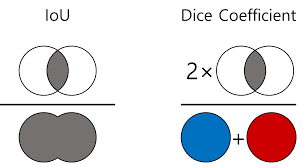
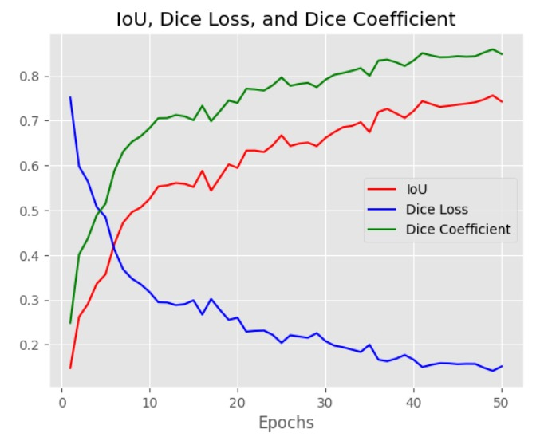
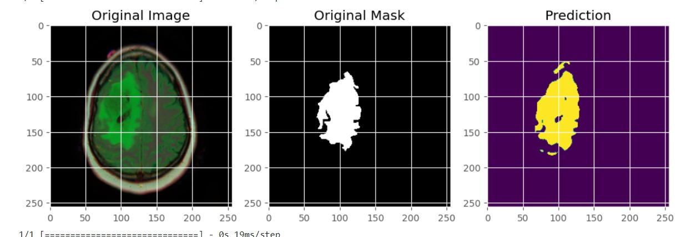
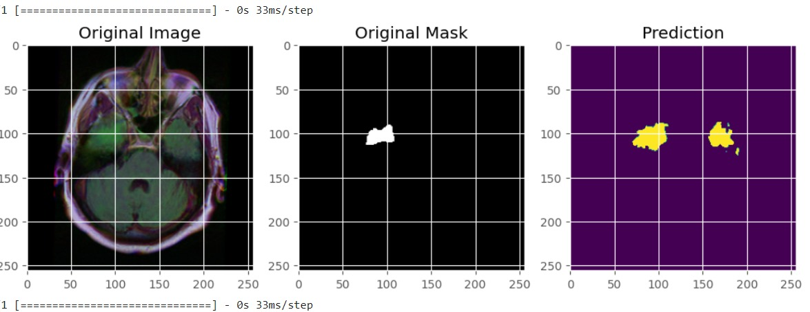

# Brain MRI Segmentation

This project focuses on segmenting brain MRIs using the U-Net architecture. 

## Table of Contents

- [Introduction](#introduction)
- [Model Architecture](#model-architecture)
- [Loss Functions](#loss-functions)
- [Training Evaluation](#training-evaluation)
- [Predictions](#prediction)

## Introduction

Brain MRI segmentation is a crucial task in medical imaging that involves partitioning an MRI scan into different regions, particularly highlighting areas of interest such as lesions or tumors. This project employs the U-Net architecture for the segmentation task.

## Model Architecture

The model architecture used is U-Net, a convolutional network designed for biomedical image segmentation.

- **Encoder**: The encoder consists of a series of convolutional layers that progressively reduce the spatial dimensions of the input image while extracting abstract features. Each convolutional layer applies a set of learnable filters to the input, capturing hierarchical features at different scales.

- **Decoder**: The decoder comprises a series of transposed convolutional layers that upsample the feature maps generated by the encoder to match the original input image size. These layers reconstruct the spatial information lost during the encoding process, gradually recovering fine-grained details.

- **Skip Connections** : Skip connections, also known as residual connections, establish direct connections between corresponding layers in the encoder and decoder. These connections facilitate the flow of high-resolution features from the encoder to the decoder, enabling the model to capture both local and global context effectively.

These components collectively form the U-Net architecture, which is widely used for biomedical image segmentation tasks due to its ability to capture intricate details while preserving spatial information.

## Loss Functions

Two loss functions are used to optimize the segmentation performance: Dice Loss and Intersection over Union (IoU) Loss.

- **Dice Coefficient**: Dice Loss measures the overlap between the predicted segmentation and the ground truth.
- **Intersection over Union (IOU)**: IoU measures the overlap between the predicted segmentation and the ground truth segmentation. It is calculated as the ratio of the area of intersection between the predicted and ground truth regions to the area of their union.

## Training evaluation

## Prediction

